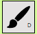

# Software Studio 2025 Spring
## Assignment 01 Web Canvas

### Scoring

| **Basic components** | **Score** | **Check** |
| :------------------- | :-------: | :-------: |
| Basic control tools  |    30%    |     Y     |
| Text input           |    10%    |     Y     |
| Cursor icon          |    10%    |     Y     |
| Refresh button       |    5%     |     Y     |

| **Advanced tools**     | **Score** | **Check** |
| :--------------------- | :-------: | :-------: |
| Different brush shapes |    15%    |     Y     |
| Un/Re-do button        |    10%    |     Y     |
| Image tool             |    5%     |     Y     |
| Download               |    5%     |     Y     |

| **Other useful widgets** | **Score** | **Check** |
| :----------------------- | :-------: | :-------: |
| Name of widgets          |   1~5%    |     Y     |

---

### How to use 

利用右邊的多種按鈕去決定現在是什麼模式

決定筆的顏色，可以用slider或input裡面輸值的方式去改各自的RGB值
右上角可以看組合後的顏色
右下角的調色盤按鈕可以跑到調色盤模式

調色盤模式: 可以用點擊中間的圓圈(調色盤)跟slider去調整顏色，用Done按鈕來決定，或用Cancel按鈕來取消變更

----------------------模式說明---------------------------

調整筆&橡皮擦粗細，用slider或input都可以修改

調整字體跟字體大小

畫畫模式: 在canvas上畫畫

填滿顏色: Bonus Function 有詳細的說明

文字框: 在電機的地方生成input，如果按Enter或點擊其他地方就會將input裡的東西印在canvas上面

橡皮擦模式: 擦掉畫畫的東西

清除按鈕： 刪掉所有canvas裡面的東西

彩虹筆模式: Bonus Function 有詳細的說明

點/線模式: Bonus Function 有詳細的說明

    
各種圖形

決定要不要填滿圖形的顏色

Bonus Function 有詳細的說明

在canvas放照片

下載canvas的照片

undo

redo

    

### Bonus Function description

    1. 填滿顏色功能
        在邊界裡面填滿目前設定的顏色
    2. 彩虹筆
        畫畫的時候筆的顏色會漸漸的改成彩虹色
    3. 點/線模式
        可以決定彩虹筆以外所有畫畫的東西是否要變成一條線或斷掉的線
        斷掉的長度跟空白的長度可以由這個功能按鈕的右邊的input來決定
    4. 在助教範例裡面沒有提到的圖形
        星星：畫星星
        箭頭：以一開始的點為基準，如果往右移滑鼠，就畫出向右的箭頭，往左移，畫出向左的箭頭。如果按了箭頭旁邊的"改方向"按鈕的話，會將畫出來的箭頭的方向改成上下，往上移，畫出向上的箭頭，往下移，畫出鄉下的箭頭。
    5. 關掉menu的功能
        如果放大網頁的話，menu會擋住canvas的部分，或因為menu也變太大，能畫的部分就變得很小，為了不要被妨礙到，點兩次canvas跟menu以外的位置的話，可以開關menu的顯示。
    6. 快捷鍵功能
        upload/save以外每個按鈕都可以用鍵盤來操作。
        Color Picker: p
        筆: d, 填滿顏色: f, 輸入模式: t, 橡皮擦: e, 清空: c, 彩虹筆: r, 點/線模式: l
        圓圈: 1, 三角形: 2, 長方形: 3, 直線: 4, 星星: 5, 箭頭: 6, 塗滿/不塗滿圖形: 9, 改變箭頭方向: 0
        undo: Ctrl + z, redo: Ctrl + y
        而且undo跟redo以外這些都可以在每個按鈕的右下方看到

### Web page link

    https://ss-hw1-76f20.web.app

### Others (Optional)

